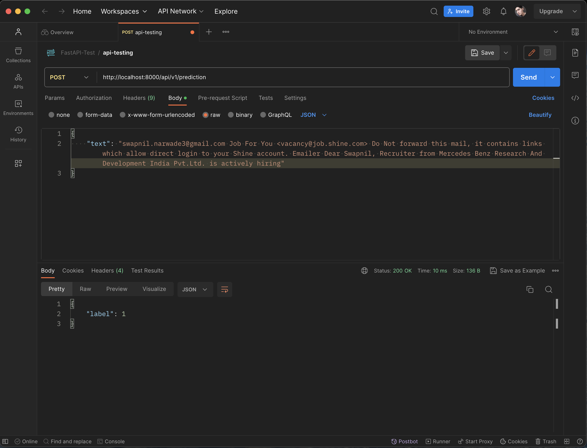
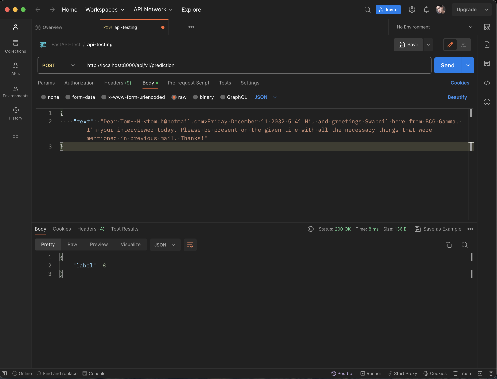

# Emails Classification API

This is a simple **Emails Classification API**/(Spam-Ham classification), built using **FastAPI** and **Scikit-learn**.

## Description

- Designed and developed a state-of-the art machine learning model to accurately classify emails as phishing or non-phishing.
- Leveraged the FastAPI framework for a high-performance deployment integration, ensuring an optimized API service.
- Engineered features from raw email data, enhancing the model's ability to discern subtle cues of phishing attempts.
- Exposed the machine learning model as a REST-API, enabling real-time predictions and seamless integration into various platforms

## Screenshots

<h3 style="color:teal">Detecting Phishing email</h3>

<h3 style="color:darkorange">Non-Phishing email detection</h3>

> [!NOTE]
> This repository is built for learning Purpose only.
